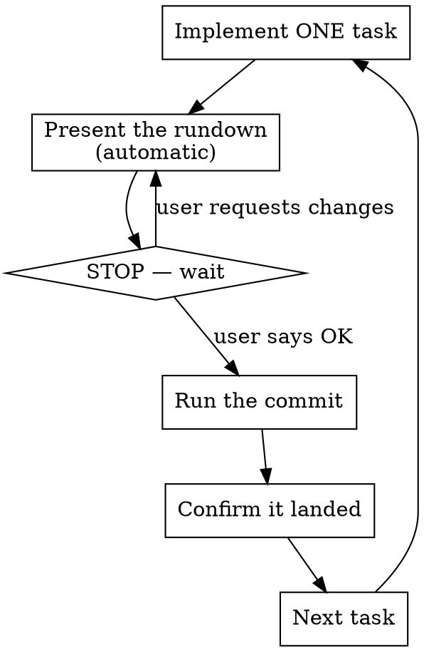

# Incremental Commits

Work in small, reviewable commits — **one plan task at a time**. After each unit you
present a rundown, **stop**, and commit only on the user's OK. You **never** start the
next unit until the current one is committed. The commit is the checkpoint that keeps
progress safe and reviewable.

## The Loop (do not reorder, do not skip)

## One task = one commit

- Each commit is one coherent, independently reviewable change — typically **one task**
  from the plan (its failing test + the implementation that makes it pass).
- If a task turns out large, split it into several small commits, each one green.
- **Never** batch multiple tasks into one commit.
- **Never** commit a broken state — tests must pass before you propose the commit.

## The Rundown (present before EVERY commit, without being asked)

Keep it scannable so the user can approve without reading the diff:

- **Task** — which plan task / what was built (one line)
- **Files changed** — `path` — what changed in each, one bullet apiece
- **Tests** — exact command(s) run and the result (e.g. `pytest tests/test_x.py` → PASS)
- **Notes** — deviations from the plan, judgment calls, or follow-ups (omit if none)
- **Proposed commit** — the exact commit message you'll use

## The commit gate

1. After the rundown, **STOP and wait**. Do not run `git commit` yet.
2. On the user's go-ahead ("commit", "ok", "go"), stage **only** the files listed in the
   rundown and commit with the proposed message (apply any edits the user asked for).
3. Confirm the commit landed — show the resulting subject/hash.
4. **Do not proceed** to the next task until the commit is done.

## Commit messages

- Conventional and readable: `feat:`, `fix:`, `test:`, `chore:`, `docs:`, `refactor:`.
- Imperative subject, ≈72 chars max, says **what** and **why** at a glance.
- If the plan specifies a message for the task, use it (tweak if the change diverged).
- Match the repository's existing commit style.

## Integration

- **implementation-tracker** — after the commit lands, mark the task's checkbox `[x]`
  before starting the next task.
- **executing-plans / subagent-driven-development** — this skill IS the per-task commit
  step in those workflows; follow this rhythm within them.
- **Lifecycle agents (optional)** — for non-trivial tasks, run the `reviewer` agent on the
  diff before presenting the rundown and fold its verdict into **Notes**. Skip for trivial
  changes.

## Red Flags — STOP, you're breaking the discipline

| Thought | Reality |
|---|---|
| "I'll commit these two tasks together" | One task per commit. Split them. |
| "I'll keep going and commit later" | The commit is a gate. No next task until committed. |
| "The change is obvious, I'll just commit" | Rundown first, always. The user reviews before the commit. |
| "Tests are red but it's fine for now" | Never commit a broken state. Make it green first. |
| "The user didn't tell me to stop" | Default is STOP after the rundown. Wait for an explicit OK. |

## Edge Cases

- **User edits the message** — use their wording.
- **User says split it** — break into smaller commits, rundown each.
- **Unrelated pre-existing changes in the tree** — don't sweep them in; stage only this
  task's files.
- **Not a git repo / no prior commits** — flag it and ask before assuming how to commit.
